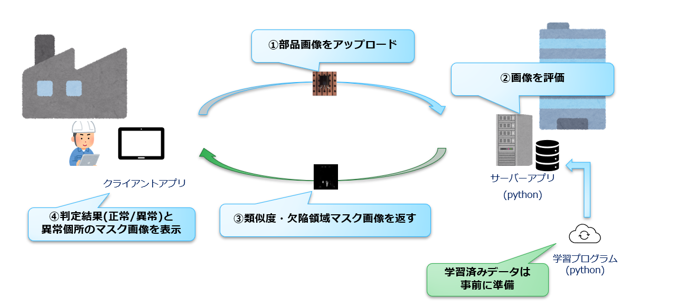
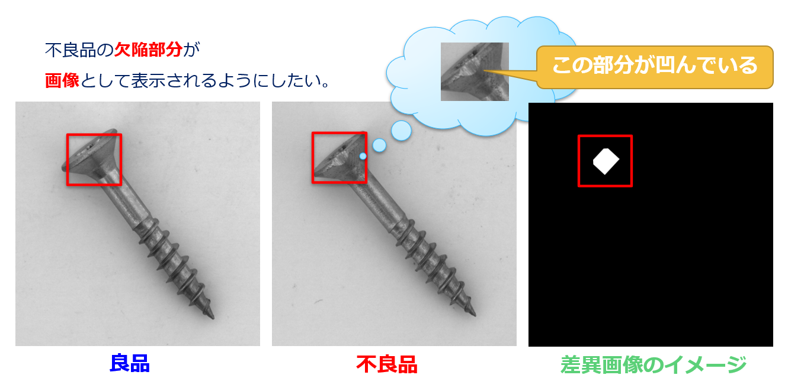
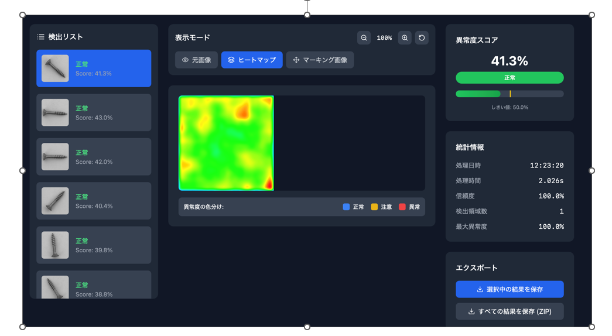

# PatchCore を用いた

## 異常検知アプリケーションの開発

Team H / AI 研修発表
発表者：近藤 大夢・石井 貴啓
日付：2025 年 7 月 22 日

---

## 背景と目的

- 弊社の顧客は製造業関連が多く、工場などの現場で発生する不良品の検知が行える機能を、弊社パッケージの一機能として実現できると付加価値につながると見込んだため。

- 現場で撮影した画像をアップロードすることで、検出結果(正常/異常)を判定できるアプリケーションを試作する。

- 不良品の発生頻度は低く、異常画像が得にくいため、「教師あり学習」は現実的ではない。

- 正常画像のみで学習・検出可能なモデルを構築する。

---

## 前回の取り組みと課題

- VAE（変分オートエンコーダ）による教師なし学習を試行
- SSIM で類似度を評価し、関数關上の関数値により異常判定
- 結果：
  - モザイク状のマスク画像になることが多い
  - 閾値設定が難しく、誤判定も多発
  - 学習データの向き・明るさのばらつきが大きく影響

---

## 改善方針

- モデル：PatchCore による教師なし異常検知に変更
- 画像のパッチ単位で特徴を抽出・比較 → 局所的な異常に強い
- 閾値に依存せず、スコアマップから異常を可視化可能
- 学習・評価時に前処理（回転・正規化）を強化

---

## PatchCore の仕組み

- 正常画像のパッチ特徴を保存（Memory Bank）
- 推論時、入力画像の各パッチと距離を計算し、異常スコアを算出
- スコアマップを生成し、異常領域を可視化
- ResNet をバックボーンとし、高精度な特徴抽出が可能

---

## システム構成

---

## アプリでやりたいこと

---

## アプリケーションを実行してみた結果

- **問題**：正常画像に対して異常スコアが高く、全体的に“異常に見える”という現象が発生。
- **仮説と改善**：
  - ✔ Core-Set の圧縮（10%）により多様性が不足 → **全データ保存に変更**
  - ✔ 特徴の正規化不足でスコアが膨張 → **L2 正規化／コサイン距離を導入**
  - ✔ スコア表示とモデル精度にズレ → **推論処理・ヒートマップ生成を修正**
  - ✔ 異常部強調のため、**マハラノビス距離**も試行

---

## アプリケーションを実行してみた結果（Before）

---

## アプリケーションを実行してみた結果（After）

---

## 改善後の結果と今後の課題

- ROC-AUC は **0.8 以上** を記録し、モデル精度は一定レベルに達成
- ただし、正常画像でも背景が強く発火するケースが残存
- **背景の誤検知抑制**や、**可視化の最適化**が次の改善ポイント

---

## まとめ

- PatchCore を用いた異常検知で、VAE の課題を解決できた。
- ROC-AUC は良好である一方、UI 上の判定の精度は依然課題。
- ライブラリや PatchCore の手法に対する理解が浅い。
  - 期待通りの結果にならない仮説が自分では立てられず、今井氏に頼りっきりだった。
